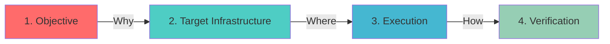

# ⚙️ Production Infrastructure & Site Reliability Engineering

### *"Documentation is automation's source code."*

**Infrastructure Engineer | Former Agency Founder | Systems Builder**

[📧 Contact](#-lets-connect) • [💼 LinkedIn](https://www.linkedin.com/in/abdulmuiz-sulaiman/) • [🚀 Main Profile](https://github.com/Devzane)

---

## 🎯 What This Repository Is

This is my **living infrastructure knowledge base**—not a tutorial collection. Every Standard Operating Procedure (SOP) documented here is battle-tested against real production systems and designed for one purpose: **to be copy-pasted by the next engineer at 3 AM when something breaks.**

As a former AI automation agency founder, I learned infrastructure the hard way: customer outages, broken deployments, and systems that mysteriously stopped working after "just a config change." These SOPs are the antidote to those 3 AM panic moments.

**Philosophy:** Infrastructure should be boring. Documentation should be executable. Systems should be reproducible.

---

## 🏗️ The 4-Pillar SOP Framework

Every procedure follows a strict engineering methodology designed for **rapid execution under pressure:**

### 1️⃣ **The Objective (The "Why")**
Defines the business or infrastructure problem before touching the terminal. No commands without context.

### 2️⃣ **Target Infrastructure (The "Where")**
Identifies OS constraints, daemon dependencies, and filesystem requirements upfront.

### 3️⃣ **Execution (The "How")**
Code-first, generalized steps using robust CLI tools. Designed for automation, not just human execution.

### 4️⃣ **Verification (The "Proof")**
Audit commands prove the system works. Includes troubleshooting for common edge cases.

---

## 📚 Production-Ready SOPs

### 🔐 Identity & Access Management (IAM)

| SOP | Problem Solved | Key Tools |
|-----|----------------|-----------|
| [**Disabling Direct SSH Root Login**](./disable-root-ssh-login.md) | Blast radius limitation & audit trailing | `sshd_config`, `systemctl` |
| [**Advanced File Security via ACLs**](./linux-acl-management.md) | Micro-targeted permissions beyond chmod | `setfacl`, `getfacl` |
| [**Provisioning Service Users**](./provision-service-user.md) | Daemon isolation with non-login accounts | `useradd`, `/sbin/nologin` |
| [**IAM Group Management**](./iam-group-provisioning.md) | Non-destructive supplementary group assignment | `usermod -aG` |

---

### 🤖 Automation & Configuration Management

| SOP | Problem Solved | Key Tools |
|-----|----------------|-----------|
| [**Passwordless SSH Trust**](./ssh-trust-provisioning.md) | Machine-to-Machine auth for CI/CD | `ssh-keygen`, `authorized_keys` |
| [**Ansible Controller Setup**](./ansible-controller-provisioning.md) | Version-pinned IaC controller deployment | `pip3`, `ansible-playbook` |
| [**Cron Task Scheduling**](./automated-task-scheduling-cron.md) | System-wide automated task orchestration | `crontab`, `crond` |

---

### ☁️ Cloud & Network Operations

| SOP | Problem Solved | Key Tools |
|-----|----------------|-----------|
| [**AWS Key Pair Management**](./aws-key-pair-sop.md) | Asymmetric cryptography & The 400 Rule | AWS CLI, `chmod` |
| [**Application Network Binding**](./jupyterlab-config-training.md) | Resolving `0.0.0.0` vs `127.0.0.1` isolation | Jupyter config, network binding |

---

### 💾 Data & Package Management

| SOP | Problem Solved | Key Tools |
|-----|----------------|-----------|
| [**Package & Dependency Management**](./linux-package-management.md) | Understanding `apt`, `yum`, `pip` ecosystems | `apt-get`, `yum`, `pip3` |
| [**Data Migration with Structure Preservation**](./data-migration-preservation.md) | Advanced `find` and `cp --parents` pipelines | `find`, `cp`, `rsync` |
| [**Log Analysis Pipelines**](./log-analysis-pipeline.md) | Horizontal/vertical text filtering at scale | `awk`, `sed`, `grep` |
| [**Archiving & Compression**](./linux-archiving-compression.md) | Bandwidth optimization via tar compression | `tar`, `gzip`, `bzip2` |

---

## 🛠️ Technical Stack

<table>
<tr>
<td valign="top" width="50%">

### Infrastructure & OS
- **Linux:** RHEL/CentOS 9, Ubuntu/Debian
- **Service Management:** systemd, cron
- **Security:** OpenSSH, ACLs, SELinux
- **Networking:** TCP/IP, DNS, load balancing

</td>
<td valign="top" width="50%">

### Automation & Cloud
- **IaC:** Ansible, Terraform
- **Cloud:** AWS (EC2, IAM, VPC, S3)
- **Scripting:** Bash, Python
- **Text Processing:** awk, sed, grep

</td>
</tr>
</table>

---

## 📊 Repository Stats

---

## 💡 Why This Matters

**For Hiring Managers:**
- These aren't tutorials—they're runbooks your team can use on day one
- Every SOP is designed for reproducibility and automation
- Documentation this rigorous signals operational maturity

**For Engineers:**
- Copy-paste solutions for common infrastructure tasks
- Troubleshooting sections save hours of debugging
- Framework applicable to any cloud or on-prem environment

---

## 🚀 How to Use This Repository

### For Interview Prep:
Pick any SOP and explain the "why" behind each command. Infrastructure interviews test whether you understand systems, not just syntax.

### For Production:
1. Read the **Objective** to confirm it matches your problem
2. Verify **Target Infrastructure** matches your environment
3. Execute commands in **Execution** section
4. Run **Verification** commands to prove it worked

### For Learning:
Follow the 4-Pillar framework for your own documentation. The methodology matters more than the specific commands.

---

## 🎓 Continuous Learning

Currently expanding knowledge in:
- **Kubernetes & Container Orchestration** (CKA track)
- **Infrastructure Cost Optimization** (AWS FinOps)
- **Observability & Monitoring** (Prometheus, Grafana)

---

## 📬 Let's Connect

**Sulaiman Abdulmuheez**  
Infrastructure Engineer | Former Agency Founder | Mechatronics Engineer

I build infrastructure that lets engineering teams move fast without breaking production. Former automation agency founder who learned infrastructure by debugging customer outages at scale.

**Open to:** Cloud Engineering · DevOps · SRE · Platform Engineering · MLOps roles  
**Location:** Remote · Based in Lagos, Nigeria

📧 **Email:** [sulaimanabdulmuheez@gmail.com](mailto:sulaimanabdulmuheez@gmail.com)  
💼 **LinkedIn:** [linkedin.com/in/abdulmuiz-sulaiman](https://www.linkedin.com/in/abdulmuiz-sulaiman/)  
🐙 **Main Portfolio:** [github.com/Devzane](https://github.com/Devzane)

---

### 🔧 *"The best infrastructure is invisible until it saves the day."*

**⭐ Star this repo if you've used any of these SOPs in production!**

---

## 📝 Contributing

Found a bug in an SOP? Have a better approach? Open an issue or PR. Infrastructure knowledge grows through collaboration.

**Contribution Guidelines:**
1. Follow the 4-Pillar framework
2. Test commands on a fresh system
3. Include troubleshooting section
4. Add verification steps

---

## 📄 License

MIT License - Use these SOPs freely. Attribution appreciated but not required.

*Last Updated: May 2026*